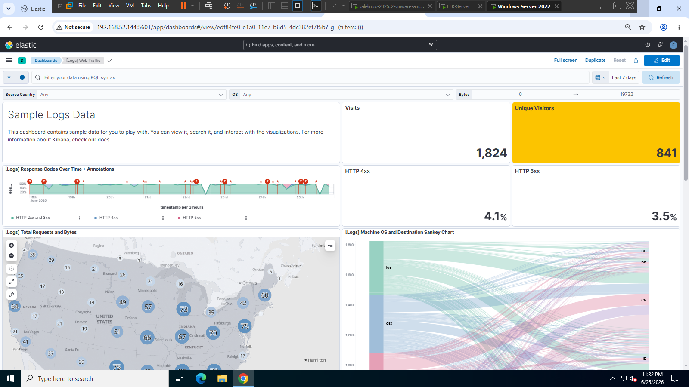
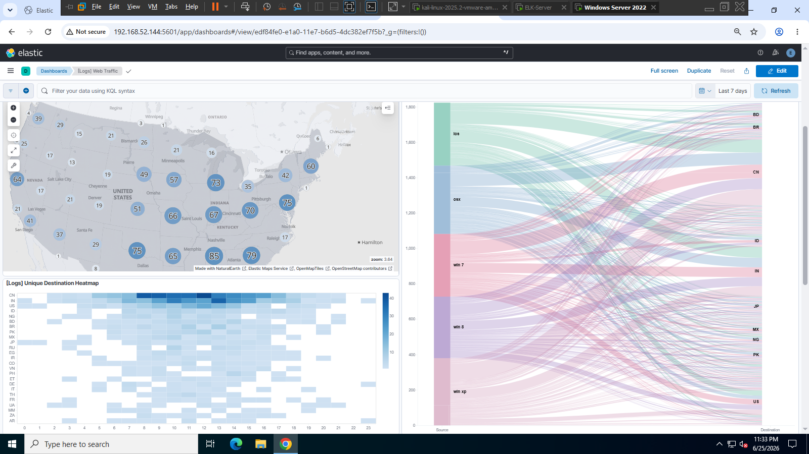
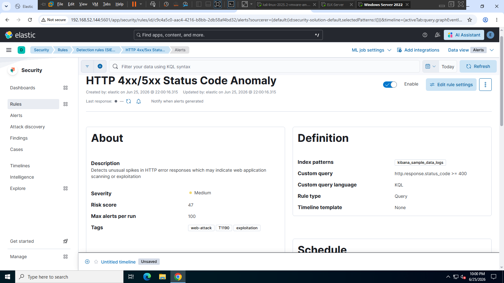
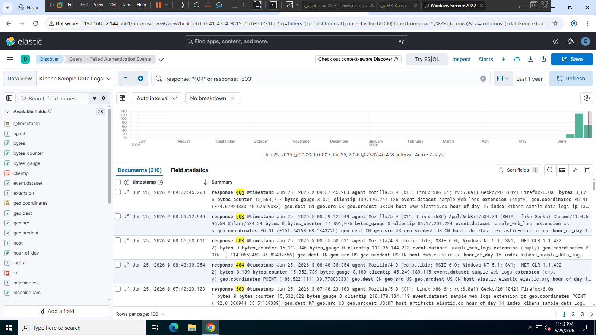

# Enterprise Security Monitoring & Detection Platform — ELK Stack

## Overview
Production-grade SIEM using ELK Stack with 5 custom detection rules, 3 executive dashboards, 5 incident investigation reports, and KQL threat hunting queries — all mapped to MITRE ATT&CK framework.

## Security Dashboard

## Detection Rule

## KQL Threat Hunting

## Incident Response

## Detection Rules
| Rule | Technique | Severity |
|------|-----------|----------|
| HTTP 4xx/5xx Anomaly | T1190 | Medium |
| Brute Force Attack | T1110.001 | High |
| SQL Injection Detection | T1190 | Critical |
| Privilege Escalation | T1548 | High |
| Data Exfiltration | T1030 | Critical |

## Incident Reports
- Incident #1: Brute Force Attack (T1110.001)
- Incident #2: SQL Injection Attack (T1190)
- Incident #3: Privilege Escalation (T1548)
- Incident #4: HTTP Anomaly (T1190)
- Incident #5: Data Exfiltration (T1030)

## Tech Stack
- Elasticsearch 8.5 — Log storage and search
- Kibana 8.5 — Dashboards and detection rules
- Logstash 8.5 — Log processing

## Author
**Muhammed Anshad V** | SOC Analyst | CSA v2 Certified
- Email: mhd.anshad.v@gmail.com
- LinkedIn: https://www.linkedin.com/in/muhemmedanshad
