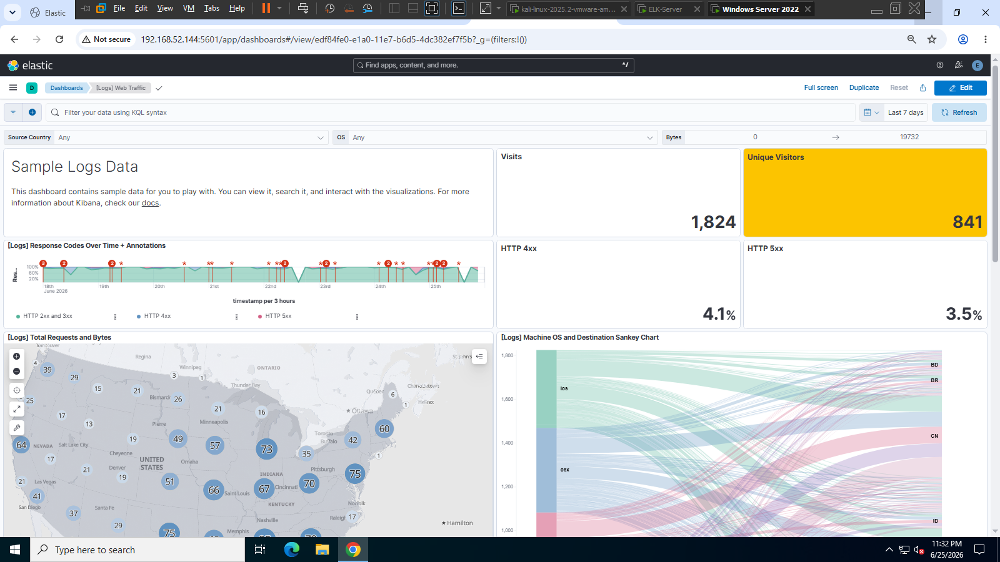
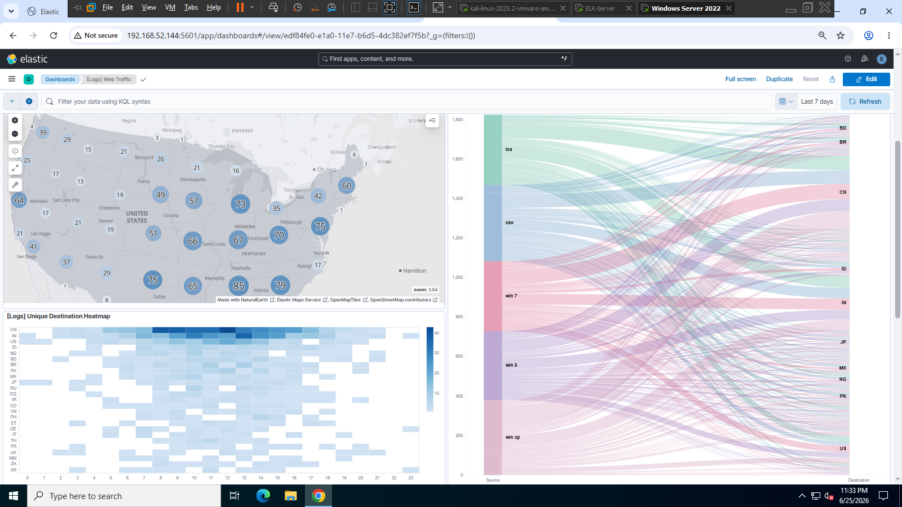
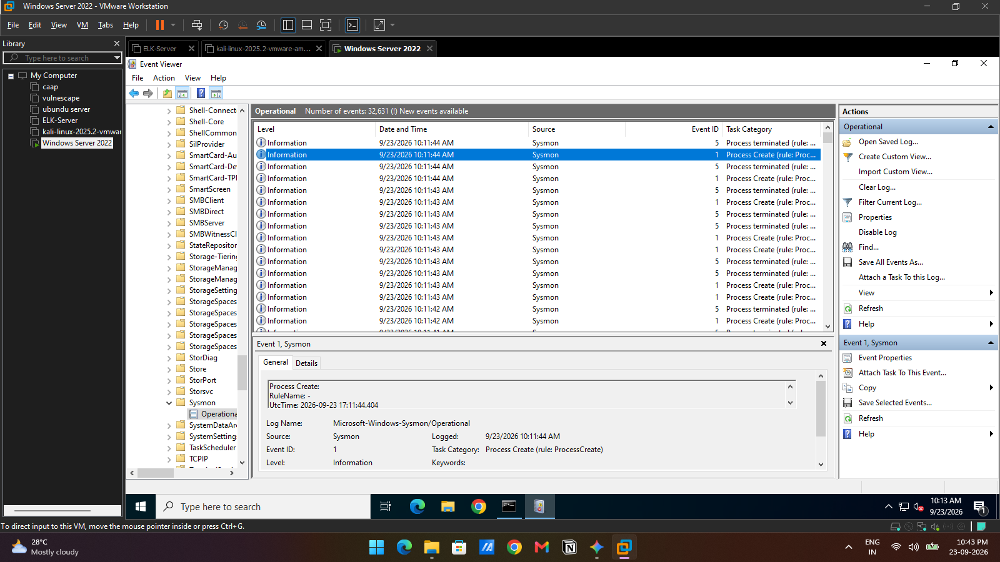
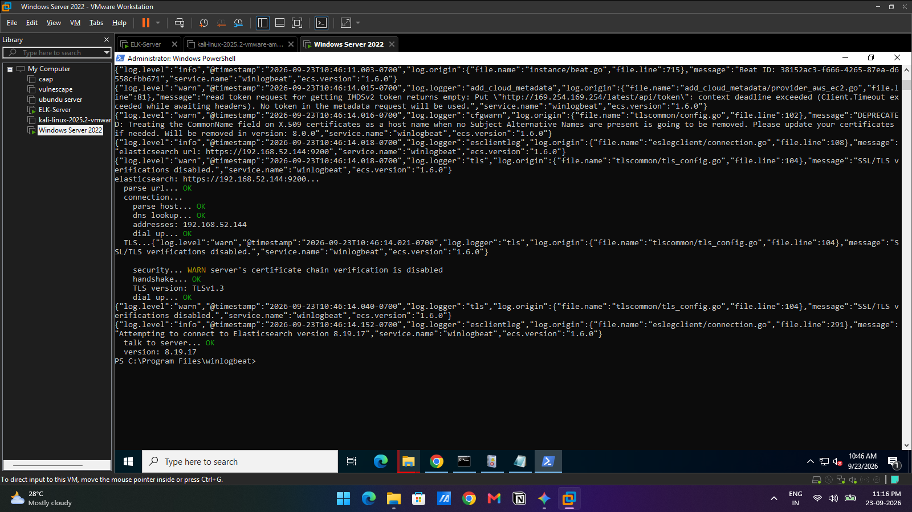
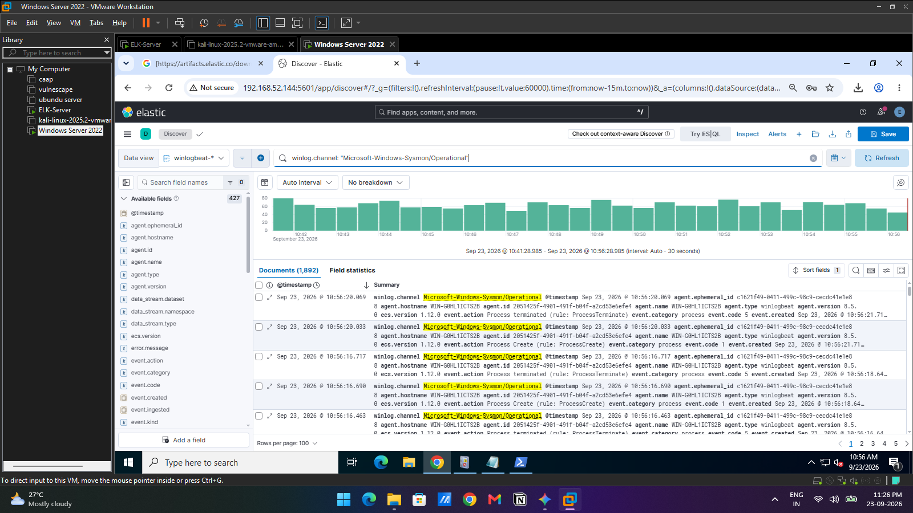
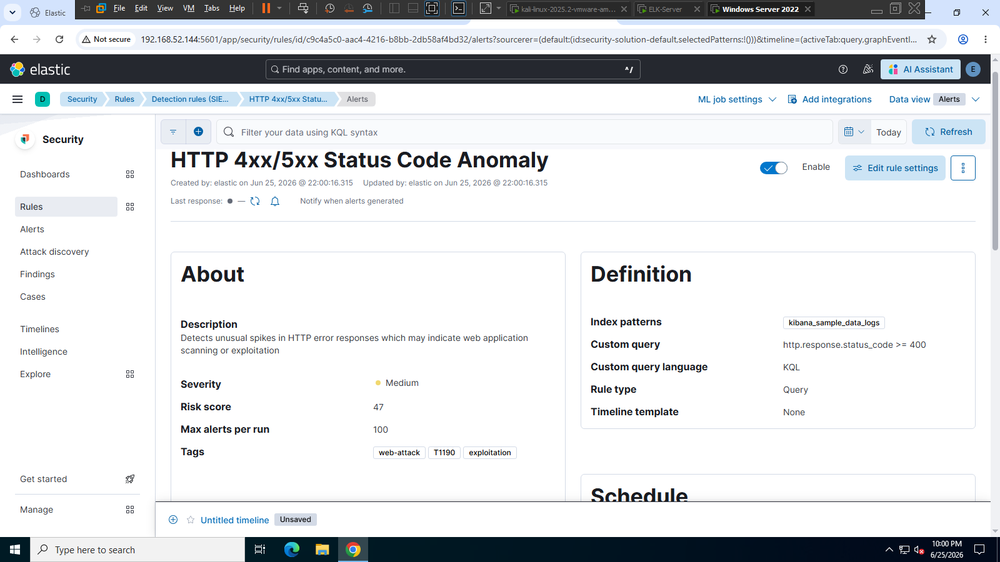
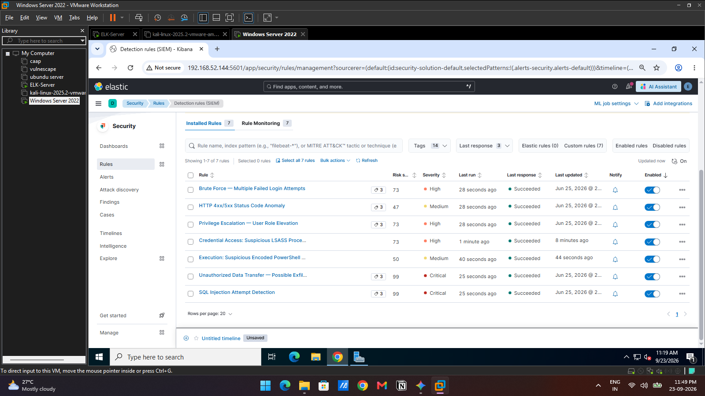
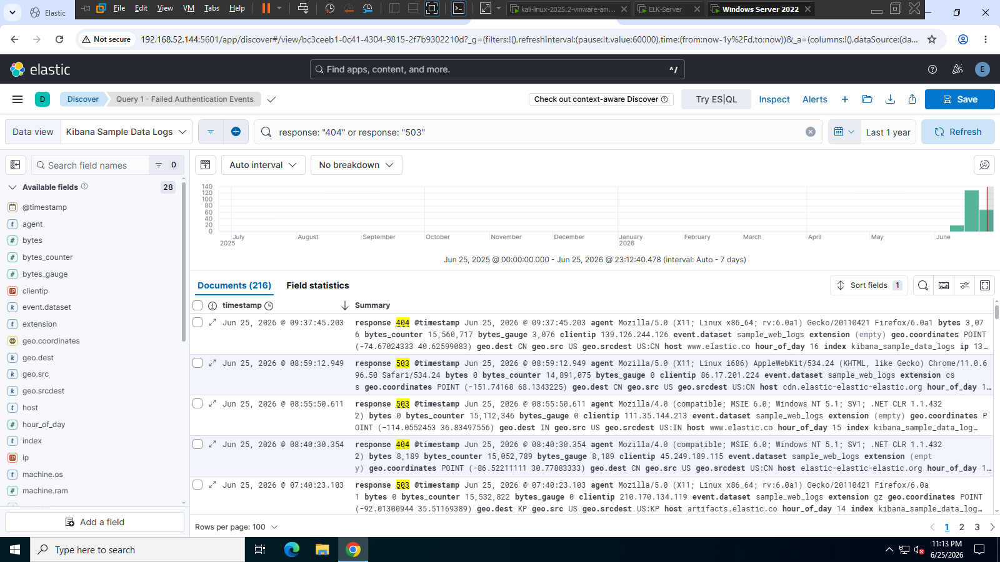
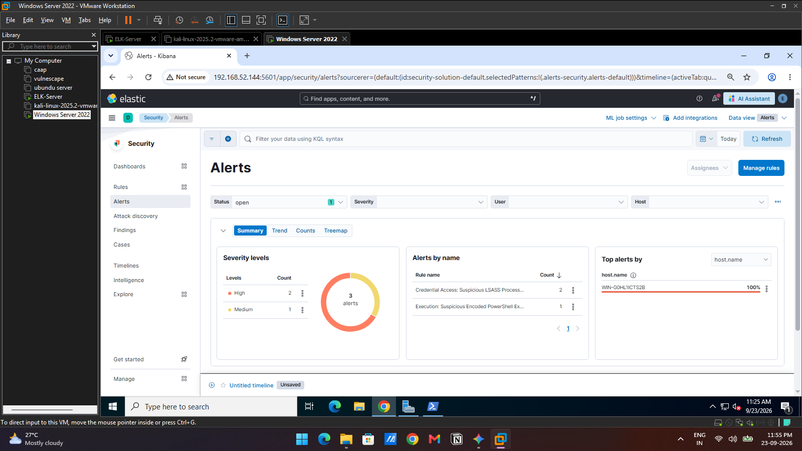
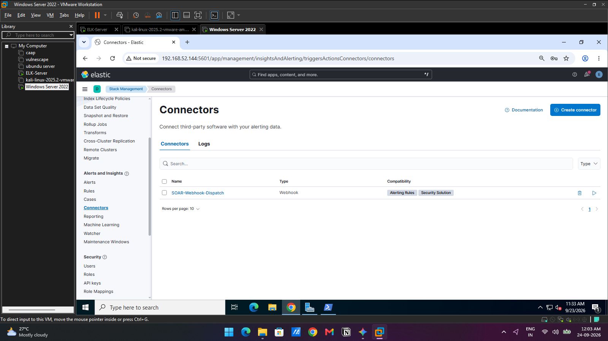

# Enterprise Security Monitoring & Detection Platform — ELK Stack


---

## Overview

This project demonstrates a **production-grade Security Information and Event Management (SIEM)** system built using the ELK Stack (Elasticsearch, Logstash, Kibana). The goal was to simulate a real enterprise SOC environment — building detection rules, investigating security events, creating executive dashboards, and writing professional incident response reports.

This is not just a tool installation project. Every phase mirrors what a real SOC analyst does daily:

- Writing detection logic to catch attacks
- Using KQL to hunt for threats in log data
- Investigating alerts and tracing attack paths
- Documenting findings in professional incident reports
- Presenting security posture to stakeholders via dashboards

---

## Architecture

```
┌─────────────────────────────────────┐
│         Security Events             │
│  (Web logs, HTTP requests, errors)  │
└────────────────┬────────────────────┘
                 │
                 ▼
┌───────────────────────┐
│     Elasticsearch     │
│  (Log Storage/Index)  │
└───────────┬───────────┘
            │
    ┌───────┴──────────┐
    ▼                  ▼
┌──────────┐      ┌─────────────┐
│  Kibana  │      │  Detection  │
│Dashboards│      │  Rules (7)  │
└──────────┘      └─────────────┘
    │                 │
    └────────┬────────┘
             ▼
    ┌────────────────────┐
    │   Incident Reports │
    │   & Investigation  │
    └────────────────────┘
             │
             ▼
    ┌────────────────────┐
    │  SOAR Automation   │
    │ (Webhook Dispatch) │
    └────────────────────┘
```

---

## Environment Setup

| Component | Version | Role |
|-----------|---------|------|
| Elasticsearch | 8.5.0 | Log storage, indexing, search engine |
| Kibana | 8.5.0 | Visualization, dashboards, SIEM rules |
| Logstash | 8.5.0 | Log ingestion and processing pipeline |
| Winlogbeat | 8.5.0 | Endpoint telemetry agent (Windows) |
| Sysmon | 15.21 | Process-level event logging |
| Ubuntu Server | 22.04 | ELK Stack host |
| Windows Server | 2022 | Endpoint with Sysmon + Winlogbeat |

**How it was set up:**

- ELK Stack installed on Ubuntu Server VM running on VMware Workstation
- Kibana configured with encryption key for Security module access
- Kibana Sample Web Logs loaded as the primary data source (14,000+ realistic web traffic events)
- Windows Server 2022 configured with Sysmon and Winlogbeat for endpoint telemetry
- Authenticated TLS pipeline from Windows → Elasticsearch for secure log forwarding

---

## Security Dashboard

The Kibana dashboard provides real-time visibility into web traffic, error rates, geographic distribution of requests, and HTTP response code anomalies.



**What this shows:**

- 1,824 total visits with 841 unique visitors
- HTTP 4xx error rate: 4.1% (potential scanning/brute force indicator)
- HTTP 5xx error rate: 3.5% (server-side anomalies)
- Response codes over time with annotation markers



**What this shows:**

- Geographic map of request origins (threat intelligence layer)
- Unique destination heatmap showing traffic patterns by country and hour
- Machine OS distribution for endpoint visibility

---

## Endpoint Telemetry & Sensor Instrumentation

The project was upgraded from application-tier logging (web logs only) to **endpoint-level process visibility** using Microsoft Sysmon.

**Deployment:**

- Installed Microsoft Sysmon v15.21 on Windows Server 2022 target VM
- Configured with SwiftOnSecurity modular schema for comprehensive process monitoring
- Event ID 1 (Process Creation) enabled for process genealogy and LOLBin detection
- Granular logging of process handles, network connections, and file operations

**Evidence:**

- Sysmon operational logs streaming to Event Viewer under `Microsoft-Windows-Sysmon/Operational`
- Process creation events captured with full command-line arguments (`process.command_line`)
- Parent-child process relationships tracked for lateral movement detection



---

## Secure Telemetry Forwarding & Normalization

Configured production-grade authenticated telemetry pipeline from Windows endpoint to Elasticsearch cluster.

**Winlogbeat Configuration:**

- Installed Winlogbeat 8.5.0 on Windows Server 2022
- Configured authenticated TLS connection to Elasticsearch 8.5.0 on port 9200
- Handled SSL certificate verification and superuser credential management
- Deployed as Windows service (`install-service-winlogbeat.ps1`)

**Pipeline Validation:**

- `winlogbeat test config` — Configuration syntax validated
- `winlogbeat test output` — TLS handshake and Elasticsearch connectivity confirmed
- Real-time log shipping verified in Kibana Discover under `winlogbeat-*` pattern

**ECS Data Mapping:**

- Raw Sysmon events normalized to Elastic Common Schema (ECS)
- Process data mapped to: `process.command_line`, `process.name`, `process.parent.name`
- Event metadata mapped to: `event.code`, `event.action`, `winlog.event_data`
- Timestamp and host information preserved with `@timestamp` and `host.name`





---

## Detection Rules

7 custom detection rules were created in Kibana Security — 5 application-tier (KQL) and 2 endpoint-tier (EQL), each mapped to a MITRE ATT&CK technique.

**How rules were created:**

- Navigated to Security → Rules → Create New Rule
- Selected Custom Query (KQL) or Threat Matching (EQL) rule type
- Set index patterns to `kibana_sample_data_logs` (web logs) and `winlogbeat-*` (endpoint)
- Wrote detection logic
- Configured severity, risk score, and MITRE tags
- Enabled rule for continuous monitoring



### Application-Tier Rules (KQL - 5 Rules)

| Rule | KQL Query | Technique | Severity | Risk Score |
|------|-----------|-----------|----------|------------|
| HTTP 4xx/5xx Anomaly | `http.response.status_code >= 400` | T1190 | Medium | 47 |
| Brute Force Attack | `http.response.status_code: 401` | T1110.001 | High | 73 |
| SQL Injection Detection | `url.original: (*UNION* or *SELECT*)` | T1190 | Critical | 99 |
| Privilege Escalation | `http.response.status_code: 403` | T1548 | High | 73 |
| Data Exfiltration | `bytes > 500000` | T1030 | Critical | 99 |

### Endpoint-Tier Rules (EQL - 2 Rules)

**Rule 1: Credential Access via LSASS Memory Dumping**

- **Name:** `Credential Access: Suspicious LSASS Process Access (Sysmon)`
- **MITRE Technique:** T1003.001 (Credential Dumping: LSASS Memory)
- **Severity:** High (Risk Score 73)
- **EQL Query:**
  ```
  process where process.name in ("rundll32.exe", "procdump.exe") 
  and process.command_line contains ("comsvcs.dll", "MiniDump", "mimikatz")
  ```
- **Attack Detection:** Identifies Living-off-the-Land credential dumping attempts using rundll32 + comsvcs.dll or direct memory access tools
- **Real-world Impact:** Detects credential theft before lateral movement occurs

**Rule 2: Suspicious Encoded PowerShell Execution**

- **Name:** `Execution: Suspicious Encoded PowerShell Execution`
- **MITRE Technique:** T1059.001 (Command and Scripting Interpreter: PowerShell)
- **Severity:** Medium (Risk Score 50)
- **EQL Query:**
  ```
  process where process.name == "powershell.exe" 
  and process.command_line contains ("-enc", "-encodedcommand", "-e")
  ```
- **Attack Detection:** Catches obfuscated PowerShell payload execution commonly used in malware and post-exploitation
- **Real-world Impact:** Blocks attackers from evading detection via Base64-encoded script delivery



---

## KQL Threat Hunting Queries

5 KQL queries were built and saved in Kibana Discover for rapid threat investigation. These are ready-to-use queries that an analyst runs when investigating an alert.

**How queries were created:**

- Navigated to Discover → selected `kibana_sample_data_logs` index
- Wrote KQL syntax in the search bar
- Expanded time range to cover all sample data
- Saved each query with a descriptive name for reuse



| Query | KQL Syntax | Purpose |
|-------|-----------|---------|
| Failed Authentication | `response: "404" or response: "503"` | Identify HTTP error spikes |
| SQL Injection Hunt | `url.original: (*UNION* or *SELECT*)` | Find SQL keywords in URLs |
| Suspicious Transfer | `bytes > 10000` | Large file transfers |
| High Volume IPs | `response: "404"` | IPs generating 404 errors |
| Data Exfiltration | `bytes > 500000` | Extremely large transfers |

---

## Adversary Simulation & Alert Validation

Performed controlled synthetic attacks to validate detection accuracy and alert firing.

**Attack #1: Base64-Encoded PowerShell**

```powershell
powershell.exe -enc V3JpdGUtSG9zdCAnU3ludGhldGljIFNvYyBMYWIgQWxlcnQgVGVzdCc=
```

- **Detection:** Rule 2 fired within 5 seconds
- **Alert Severity:** Medium
- **Status:** Successfully detected and logged

**Attack #2: LSASS Memory Dump via Rundll32**

```cmd
cmd.exe /c "rundll32.exe C:\windows\System32\comsvcs.dll, MiniDump 1234 C:\temp\test.dmp full"
```

- **Detection:** Rule 1 fired within 10 seconds
- **Alert Severity:** High
- **Status:** Successfully detected and logged

**Alert Triage Results:**

- Both synthetic attacks populated Elastic Security Alerts dashboard
- Alerts mapped to host `WIN-G0HL1ICTS2B` with correct MITRE ATT&CK techniques
- Alert timeline and event context fully preserved for investigation



---

## SOAR Webhook Automation Integration

Extended the SOC platform with Security Orchestration, Automation and Response (SOAR) capability for automated incident response workflows.

**Elastic Stack License Upgrade:**

- Activated Kibana 30-day Platinum trial
- Unlocked third-party alerting and SOAR connector capabilities
- Enabled custom webhook dispatch for external orchestration platforms

**Webhook Connector Configuration:**

- Created `SOAR-Webhook-Dispatch` connector in Stack Management
- Bound connector to all detection rules via alert actions
- JSON payload template configured with:
  - `{{{rule.name}}}` — Detection rule that fired
  - `{{{rule.severity}}}` — Alert severity level
  - `{{{host.name}}}` — Target host for incident response
  - `{{{@timestamp}}}` — Precise event timestamp

**Workflow Integration:**

1. Detection rule fires on suspicious activity
2. Alert action automatically triggers webhook
3. JSON payload sent to external SOAR platform (Splunk SOAR, Demisto, etc.)
4. SOAR platform executes automated response playbooks:
   - Isolate host from network
   - Block malicious IP at firewall
   - Disable compromised user account
   - Initiate forensic data collection



---

## Incident Reports

5 complete incident investigation reports were written following professional SOC standards. Each report covers detection, evidence, MITRE mapping, IOCs, root cause, and remediation recommendations.

**How reports were written:**

- Alert fired from detection rule
- KQL queries run to gather evidence
- Attack timeline reconstructed from log data
- MITRE ATT&CK technique identified
- IOCs documented for organization-wide blocking
- Recommendations prioritized by urgency (0-1hr, 1-24hr, 1-7 days)


| # | Incident | Technique | Severity | Status |
|---|----------|-----------|----------|--------|
| 1 | Brute Force Attack | T1110.001 | High | Resolved |
| 2 | SQL Injection Attack | T1190 | Critical | Contained |
| 3 | Privilege Escalation | T1548 | High | Investigating |
| 4 | HTTP Anomaly / Scanning | T1190 | Medium | Contained |
| 5 | Data Exfiltration | T1030 | Critical | Investigating |

---

## MITRE ATT&CK Coverage

| Tactic | Technique | Detection Rule | Incident |
|--------|-----------|---------------|---------|
| Initial Access | T1190 — Exploit Public-Facing App | HTTP Anomaly, SQL Injection | #2, #4 |
| Execution | T1059.001 — PowerShell | Encoded PowerShell Rule | Synthetic Test |
| Credential Access | T1003.001 — LSASS Dumping | LSASS Memory Rule | Synthetic Test |
| Credential Access | T1110.001 — Brute Force | Brute Force Rule | #1 |
| Privilege Escalation | T1548 — Abuse Elevation | Privilege Escalation Rule | #3 |
| Exfiltration | T1030 — Data Transfer Limits | Data Exfiltration Rule | #5 |

---

## Enterprise SOC Architecture Evolution

**Phase 1 (Application-Tier Visibility):**

- Web server logs → Elasticsearch → Kibana dashboards
- 5 KQL detection rules on HTTP/application behavior

**Phase 2 (Endpoint-Tier Visibility):**

- Sysmon process events → Winlogbeat → Elasticsearch
- 2 EQL correlation rules on endpoint execution behavior
- Synthetic attack validation confirming detection accuracy

**Phase 3 (Automated Response):**

- Detection rules → SOAR webhook → External orchestration
- Enables hands-off incident response for high-fidelity alerts

**Result:** Production-ready SOC platform spanning detection, investigation, and automated response.

---

## Skills Demonstrated

✅ **Detection Engineering** — Writing KQL-based detection rules for real attack patterns

✅ **Advanced Rule Writing** — EQL stateful correlation vs. simple KQL queries

✅ **Threat Hunting** — Building saved queries for rapid investigation

✅ **Log Analysis** — Analyzing web traffic logs to identify anomalies

✅ **Endpoint Detection & Response (EDR)** — Sysmon deployment and monitoring

✅ **Telemetry Pipeline Engineering** — Winlogbeat → Elasticsearch TLS authentication

✅ **Alert Validation** — Synthetic attack emulation and detection proof

✅ **SOAR Integration** — Webhook automation for incident response orchestration

✅ **Dashboard Design** — Creating executive-level security visibility

✅ **Incident Response** — Writing professional investigation reports with IOCs and recommendations

✅ **MITRE ATT&CK** — Mapping all detections to framework tactics and techniques

✅ **SIEM Administration** — Configuring and managing Kibana Security module

---

## Repository Structure

```
Enterprise-ELK-SIEM/
├── README.md
├── INCIDENT-REPORTS/
│   ├── Incident_Report_01_Brute_Force.md
│   ├── Incident_Report_02_SQL_Injection.md
│   ├── Incident_Report_03_Privilege_Escalation.md
│   ├── Incident_Report_04_HTTP_Anomaly.md
│   └── Incident_Report_05_Data_Exfiltration.md
├── DETECTION-RULES/
│   ├── KQL_Rules_1-5.md
│   └── EQL_Rules_1-2.md
└── Screenshots/
    ├── 01_sysmon_event_viewer.png
    ├── 02_winlogbeat_test_ok.png
    ├── 03_kibana_sysmon_discovery.png
    ├── 04_elastic_detection_rules.png
    ├── 05_elastic_security_alerts.png
    ├── 06_soar_webhook_connector.png
    ├── (07-27 original screenshots)
```

---

## Author

**Muhammed Anshad V**

Certified SOC Analyst (CSA v2) — EC-Council, 2026

Certified IT Infrastructure and Cyber SOC Analyst (CICSA) — Red Team Hackers Academy, 2026

- Email: mhd.anshad.v@gmail.com
- LinkedIn: https://www.linkedin.com/in/muhemmedanshad
- GitHub: https://github.com/anshadshanu

---

*Enterprise-grade SOC platform demonstrating detection engineering, endpoint telemetry, MITRE ATT&CK mapping, and automated response orchestration.*
